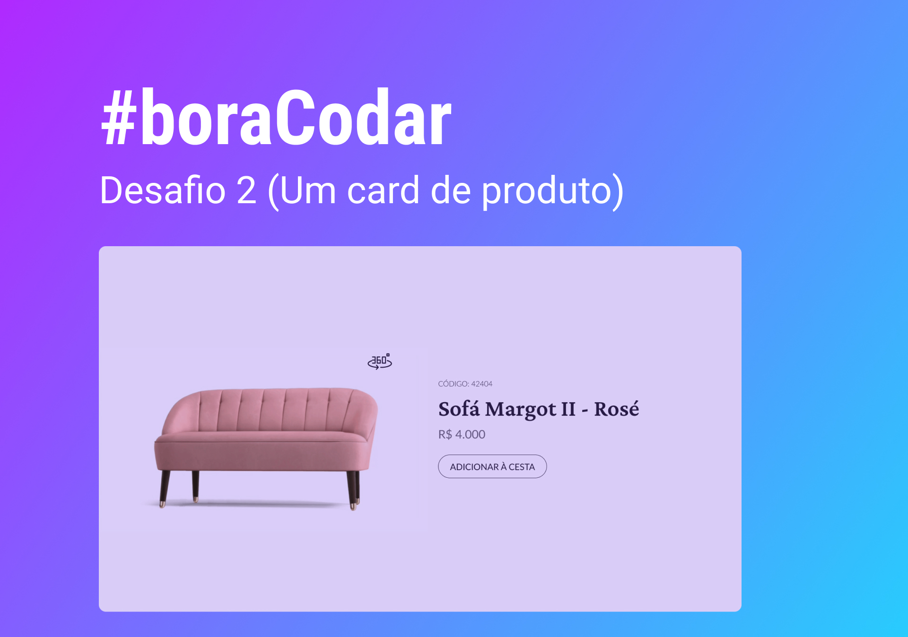

<div align="center">

<h1> Bora Codar #02 </h1>
</div>
<h2>📃 Sobre</h2><p>
<br>
#BoraCodar - O bora codar é uma série de desafios criado pela Rocketseat com intuito de estimular desenvolvedores/as a se desafiar com projetos pequenos, porém com uma abrangência e conceitos enormes que fazem parte do nosso dia a dia como desenvolvedor web front-end. O desafio funciona da seguinte forma, eles mandam o desafio no linkedin ou no site da plataforma com um layout no figma e nós temos 1(uma) semana para realizar o desafio.<p>
Este desafio em questão foi de codificar um layout de card de produto onde eu clicar no botão 360º a imagem gira.

Segue o link do layout com o desafio no figma - https://www.figma.com/community/file/1195050984449538256

<br>

## 🚀 Tecnologias e ferramentas utilizadas

<br>

- [HTML](https://en.wikipedia.org/wiki/HTML): A HyperText Markup Language, ou HTML, é a linguagem de marcação padrão para documentos projetados para serem exibidos em um navegador da web. Ele pode ser auxiliado por tecnologias como Cascading Style Sheets (CSS) e linguagens de script como JavaScript.

- [CSS](https://developer.mozilla.org/en-US/docs/Web/CSS): Cascading Style Sheets (CSS) é uma linguagem de folha de estilo usada para descrever a apresentação de um documento escrito em HTML ou XML (incluindo dialetos XML como SVG, MathML ou XHTML). CSS descreve como os elementos devem ser renderizados na tela, no papel, na fala ou em outras mídias.

- [JavaScript](https://developer.mozilla.org/pt-BR/docs/Learn/JavaScript/First_steps/What_is_JavaScript): JavaScript, often abbreviated as JS, is a programming language that is one of the core technologies of the World Wide Web, alongside HTML and CSS. As of 2022, 98% of websites use JavaScript on the client side for webpage behavior, often incorporating third-party libraries.

<br>

Para baixar o código-fonte do projeto em sua máquina, primeiramente terá que ter instalado o [**Git**](https://git-scm.com/).

Com o Git instalado, em seu terminal execute o seguinte comando:

```bash
git clone

git@github.com:PhilipeF/boraCodar-02.git
```

Execute o projeto:

```
Para executar o projeto use a extensão Live Server do vscode.
```

<h2> 🖼️ Segue abaixo um video da conclusão do desafio</h2>

<br>
<br>

## 📲 Contato

Entre em contato comigo por e-mail ou pelo meu LinkedIn:

<a href="mailto:philipsferreiraa@gmail.com"></a>
<a href="https://www.linkedin.com/in/philipe-ferreira-60696388/"></a>
